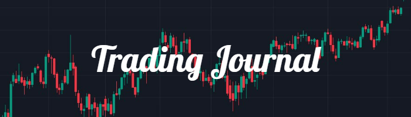
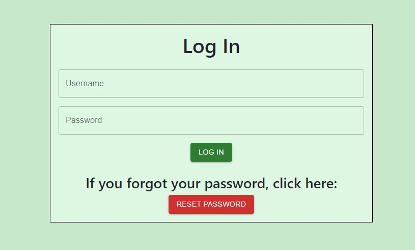
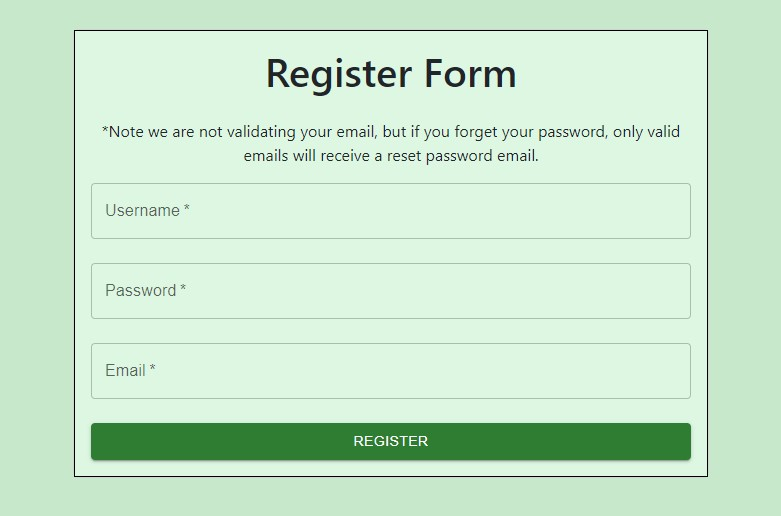
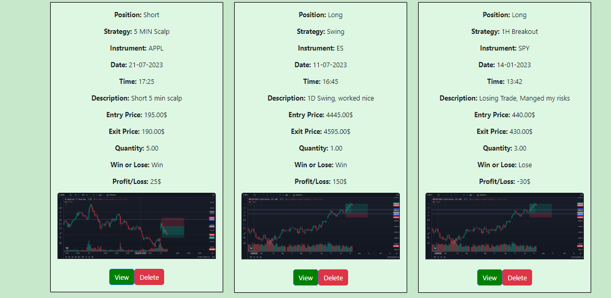
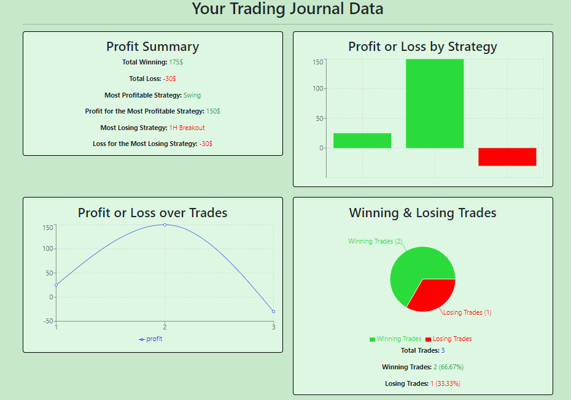
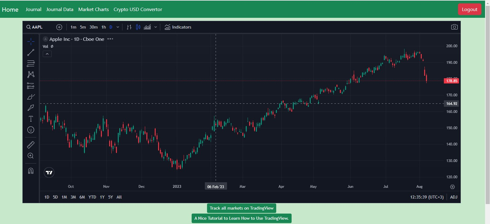
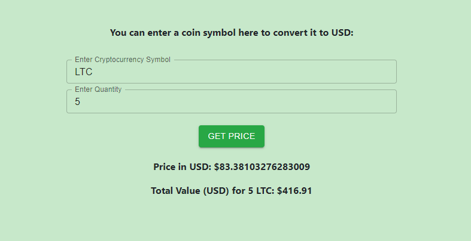

# Your Trading Journal





A web-based trading journal for stock market, futures, and crypto traders. Document your trades, visualize data with interactive charts, and stay updated with real-time coin prices using Coin Market Cap's API.

## Table of Contents

- [About](#about)
- [Installation](#installation)
- [Usage](#usage)
- [Features](#features)
- [Technologies](#technologies)
- [Contributing](#contributing)
- [License](#license)
- [Contact](#contact)

## About

"Your Trading Journal" is a web-based trading journal application designed for stock market, futures, and crypto traders. It allows users to document and analyze their trades effortlessly. The application uses Django as the backend framework and React with Redux in TypeScript for the frontend. Users can log trades with essential details, visualize performance with interactive charts, and access market charts powered by the TradingView widget. Additionally, users can fetch real-time coin prices using Coin Market Cap's API. "Your Trading Journal" simplifies trade management and provides valuable insights for better decision-making.

## Installation

### Setup:

##### Backend 
Clone the repository from GitHub:

```
git clone https://github.com/AndyMelm/django_redux_project.git
```


Navigate to the backend directory, create & activate a virtual environment:

```
#backend directory
cd django_redux_project/Back 

#create virutal environment
python -m venv venv

#activate virutal environment
venv\Scripts\activate 
```

Install the required Python packages:

```
pip install -r requirements.txt
```


Create ".env" file in Back directory (django_redux_project/Back) and add the following lines:

```
# Replace with your actual values
SECRET_KEY = 'YOUR_DJANGO_SECRET_KEY'
DEBUG = True
EMAIL_HOST = 'smtp.elasticemail.com' #i am suing elastic email, but you can use what is best for you
EMAIL_PORT = 2525
EMAIL_HOST_USER = 'YOUR_EMAIL_HOST_USER'
EMAIL_HOST_PASSWORD = 'YOUR_EMAIL_HOST_PASSWORD'
EMAIL_USE_TLS = True
DEFAULT_FROM_EMAIL = 'YOUR_DEFAULT_FROM_EMAI'

 #To fetch crypto prices i am using Coin Market Cap API-key, please add yours.
 #https://coinmarketcap.com/api/documentation/v1/#section/Quick-Start-Guide
api_key_converter = 'YOUR_API_KEY'

# Replace with your actual values
NAME=YourDatabaseName
USER=YourDatabaseUser  # Default might be 'root'
PASSWORD=YourPassword
HOST=YourDatabaseHost
PORT=YourDatabasePort  # Default is 3306

```
Create a superuser (optional - for admin access) & Run the Django development server:
```
#create superuser
python manage.py createsuperuser

#run the server
python manage.py runserver
```


The backend should now be up and running on http://localhost:8000/.

#### Frontend
Open another terminal & Navigate to the frontend directory:

```
#frontend directory - Front

#frontend app directory - my-app

cd django_redux_project/Front/my-app
```

Install the dependencies and run the server:

```
#install the dependencies
npm i #or npm install

#run the server
npm start
```


## Usage

After successfully installing the project and its dependencies, you can start using "Your Trading Journal" to document and analyze your trades. 
The application will be accessible at http://localhost:3000/ in your web browser.


##### Log Trades:
* On the home page, you'll be prompted to log in or sign up for an account.
* Once logged in,navigate to the "Journal" section, click on the "Add Trade" button to add a new journal entry.
* Fill in the essential details, such as strategy, instrument, date, time, entry/exit prices, quantity, position, and outcome (win or loss).
* Add additional notes or description for the trade and attach an image if relevant.
* View or Delete existing entries.




##### Visualize Performance:
* To view your trading performance, navigate to the "Journal Data" section.
* Observe interactive charts that display your trade history, P&L (Profit & Loss), and other relevant metrics.


##### Access Market Charts:
* In the "Market Charts" section, explore various charts powered by the TradingView widget.


##### Crypto USD Converter:
* In the "Crypto USD Converter" section, enter the name and quantity of the coin you're interested in.
* Fetch real-time coin prices using Coin Market Cap's API and stay informed about current market values.


##### Watch the Tutorial Video

[](https://www.youtube.com/watch?v=Zi3pouhnUWQ&ab_channel=AndyMelm)

Click on the image above to watch the tutorial video on YouTube.


## Features

* Log and track trades for stock market, futures, and crypto.
* Visualize trade performance with interactive charts.
* Access market charts powered by the TradingView widget. (https://www.tradingview.com/widget/symbol-overview/)
* Fetch real-time coin prices using Coin Market Cap's API. (https://coinmarketcap.com/api/documentation/v1/#section/Quick-Start-Guide)
* User-friendly interface for seamless trade management.


## Technologies

#### Backend:
- Django (Python web framework)
- Django REST framework (for building RESTful APIs)
- SQLite (Database)
- Django Templates (for rendering dynamic HTML content on the server-side)

#### Frontend:
- React (JavaScript library)
- Redux (state management)
- TypeScript 
- HTML
- CSS
- Bootstrap 
- MaterialUI (MUI)
- Recharts (charting library for React)

#### Data Visualization:
- TradingView Widget (for interactive market charts)
- Recharts (charting library for React)

#### API Integration:
- Coin Market Cap API (for fetching real-time coin prices)

## Tests

#### Running Backend Tests:
To run the backend tests locally, use the following command:

```
python manage.py test
```

#### Running Frontend Tests:
To run the frontend tests locally, use the following command:

```
npm test
```


## Contributing

As "Your Trading Journal" is a personal project developed with guidance from my supervisor, I am not actively seeking external contributions at this time. However, I appreciate your interest in the project.

If you have suggestions, bug reports, or feature requests, you are welcome to raise them as issues on the GitHub repository. I will review and consider them to improve the project.

Thank you for understanding!

## License


## Contact

If you have any questions or want to get in touch, you can reach out via:

Email: andrey.melman93@gmail.com
LinkedIn: https://www.linkedin.com/in/andrey-melman-636b49277/

For project hosting and deployment:

- Render: [Deployed to Render](https://render-trading-journal.onrender.com/) 
- Netlify: [Deployed to Netlify](https://your-trading-journal.netlify.app/) 
- For docker use this repo:[Docker](https://github.com/AndyMelm/project_dockerized/) 

#### Admin Access:

If you would like to access the project as an admin user, please use the following credentials:

- Username: admin
- Password: 1234

Feel free to use the provided email or LinkedIn link to contact me.
